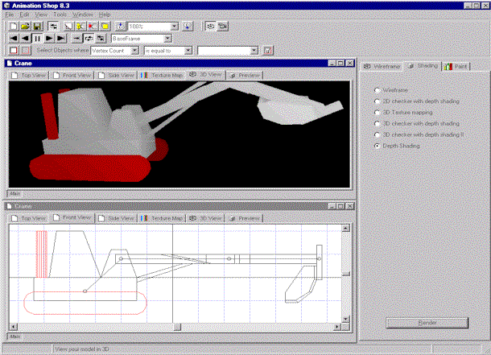



## Animation Shop 8\.3

### Description

This program is a 3D CAD type thing, with quite a load of features. Ok, so it aint perfect, but its FREE!! Wow, much inproved interface, and options etc. Includes a DirectX and Software driven 3D engine, but requires the DirectX7 runtime files to be present, so if your on NT, you'll have to comment out some code to get it to run... Anyway, samples and help files are included, and inport samples. Not everthing works, this is still a working project, but is almost done, so enjoy!! PS. this file is 500k, I have took out loads of BMP files to reduce size, coz PSC wouldn't upload it before. Still, you might just be impressed...
 
### More Info
 

             |
---                |---
**Submitted On**   |2002-10-30 08:47:12
**By**             |[DeadFred](https://github.com/Planet-Source-Code/PSCIndex/blob/master/ByAuthor/deadfred.md)
**Level**          |Advanced
**User Rating**    |5.0 (225 globes from 45 users)
**Compatibility**  |VB 6\.0
**Category**       |[Complete Applications](https://github.com/Planet-Source-Code/PSCIndex/blob/master/ByCategory/complete-applications__1-27.md)
**World**          |[Visual Basic](https://github.com/Planet-Source-Code/PSCIndex/blob/master/ByWorld/visual-basic.md)
**Archive File**   |[Am814890710302002\.zip](https://github.com/Planet-Source-Code/deadfred-animation-shop-8-3__1-40259/archive/master.zip)

